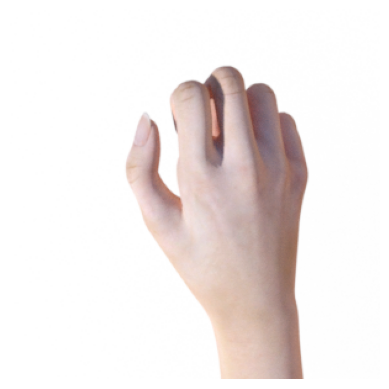
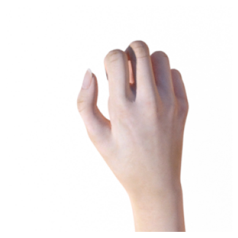
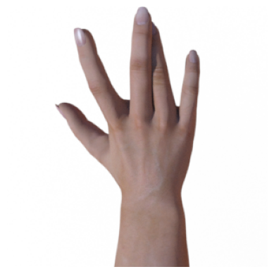
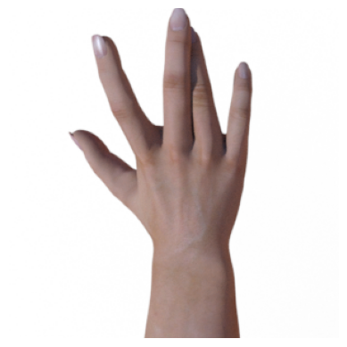
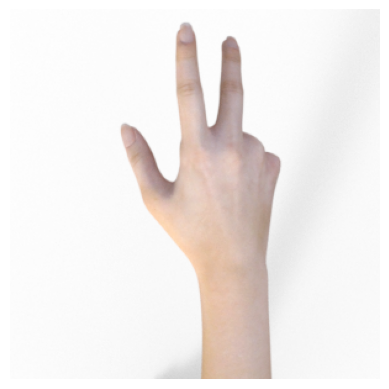
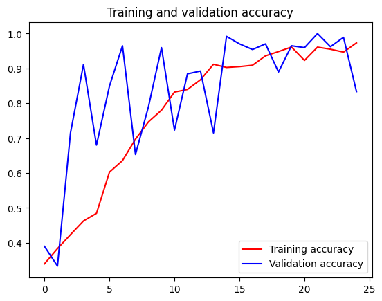
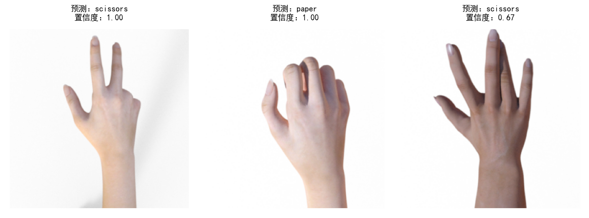

# TensorFlow 石头剪刀布模型生成
```python
import os
import zipfile

local_zip = 'D:/AndroidStudioProjects/Jupyter/rps.zip'
zip_ref = zipfile.ZipFile(local_zip, 'r')
zip_ref.extractall('D:/AndroidStudioProjects/Jupyter/')
zip_ref.close()

local_zip = 'D:/AndroidStudioProjects/Jupyter/rps-test-set.zip'
zip_ref = zipfile.ZipFile(local_zip, 'r')
zip_ref.extractall('D:/AndroidStudioProjects/Jupyter/')
zip_ref.close()

```


```python
rock_dir = os.path.join('D:/AndroidStudioProjects/Jupyter/rps/rock')
paper_dir = os.path.join('D:/AndroidStudioProjects/Jupyter/rps/paper')
scissors_dir = os.path.join('D:/AndroidStudioProjects/Jupyter/rps/scissors')

print('total training rock images:', len(os.listdir(rock_dir)))
print('total training paper images:', len(os.listdir(paper_dir)))
print('total training scissors images:', len(os.listdir(scissors_dir)))

rock_files = os.listdir(rock_dir)
print(rock_files[:10])

paper_files = os.listdir(paper_dir)
print(paper_files[:10])

scissors_files = os.listdir(scissors_dir)
print(scissors_files[:10])

```

    total training rock images: 840
    total training paper images: 840
    total training scissors images: 840
    ['rock01-000.png', 'rock01-001.png', 'rock01-002.png', 'rock01-003.png', 'rock01-004.png', 'rock01-005.png', 'rock01-006.png', 'rock01-007.png', 'rock01-008.png', 'rock01-009.png']
    ['paper01-000.png', 'paper01-001.png', 'paper01-002.png', 'paper01-003.png', 'paper01-004.png', 'paper01-005.png', 'paper01-006.png', 'paper01-007.png', 'paper01-008.png', 'paper01-009.png']
    ['scissors01-000.png', 'scissors01-001.png', 'scissors01-002.png', 'scissors01-003.png', 'scissors01-004.png', 'scissors01-005.png', 'scissors01-006.png', 'scissors01-007.png', 'scissors01-008.png', 'scissors01-009.png']


```python
%matplotlib inline

import matplotlib.pyplot as plt
import matplotlib.image as mpimg

pic_index = 2

next_rock = [os.path.join(rock_dir, fname) 
                for fname in rock_files[pic_index-2:pic_index]]
next_paper = [os.path.join(paper_dir, fname) 
                for fname in paper_files[pic_index-2:pic_index]]
next_scissors = [os.path.join(scissors_dir, fname) 
                for fname in scissors_files[pic_index-2:pic_index]]

for i, img_path in enumerate(next_rock+next_paper+next_scissors):
    #print(img_path)
    img = mpimg.imread(img_path)
    plt.imshow(img)
    plt.axis('Off')
    plt.show()
```


​    

​    



    



    



    



    


  

```python
import tensorflow as tf
import keras_preprocessing
from keras_preprocessing import image
from keras_preprocessing.image import ImageDataGenerator

TRAINING_DIR = "D:/AndroidStudioProjects/Jupyter/rps/"
training_datagen = ImageDataGenerator(
    rescale = 1./255,
	rotation_range=40,
    width_shift_range=0.2,
    height_shift_range=0.2,
    shear_range=0.2,
    zoom_range=0.2,
    horizontal_flip=True,
    fill_mode='nearest')

VALIDATION_DIR = "D:/AndroidStudioProjects/Jupyter/rps-test-set/"
validation_datagen = ImageDataGenerator(rescale = 1./255)

train_generator = training_datagen.flow_from_directory(
	TRAINING_DIR,
	target_size=(150,150),
	class_mode='categorical',
    batch_size=126
)

validation_generator = validation_datagen.flow_from_directory(
	VALIDATION_DIR,
	target_size=(150,150),
	class_mode='categorical',
    batch_size=126
)

model = tf.keras.models.Sequential([
    # Note the input shape is the desired size of the image 150x150 with 3 bytes color
    # This is the first convolution
    tf.keras.layers.Conv2D(64, (3,3), activation='relu', input_shape=(150, 150, 3)),
    tf.keras.layers.MaxPooling2D(2, 2),
    # The second convolution
    tf.keras.layers.Conv2D(64, (3,3), activation='relu'),
    tf.keras.layers.MaxPooling2D(2,2),
    # The third convolution
    tf.keras.layers.Conv2D(128, (3,3), activation='relu'),
    tf.keras.layers.MaxPooling2D(2,2),
    # The fourth convolution
    tf.keras.layers.Conv2D(128, (3,3), activation='relu'),
    tf.keras.layers.MaxPooling2D(2,2),
    # Flatten the results to feed into a DNN
    tf.keras.layers.Flatten(),
    tf.keras.layers.Dropout(0.5),
    # 512 neuron hidden layer
    tf.keras.layers.Dense(512, activation='relu'),
    tf.keras.layers.Dense(3, activation='softmax')
])


model.summary()

model.compile(loss = 'categorical_crossentropy', optimizer='rmsprop', metrics=['accuracy'])

history = model.fit(train_generator, epochs=25, steps_per_epoch=20, validation_data = validation_generator, verbose = 1, validation_steps=3)

model.save("rps.h5")

```

    Found 2520 images belonging to 3 classes.
    Found 372 images belonging to 3 classes.

<pre style="white-space:pre;overflow-x:auto;line-height:normal;font-family:Menlo,'DejaVu Sans Mono',consolas,'Courier New',monospace"><span style="font-weight: bold">Model: "sequential"</span>
</pre>


<pre style="white-space:pre;overflow-x:auto;line-height:normal;font-family:Menlo,'DejaVu Sans Mono',consolas,'Courier New',monospace">┏━━━━━━━━━━━━━━━━━━━━━━━━━━━━━━━━━┳━━━━━━━━━━━━━━━━━━━━━━━━┳━━━━━━━━━━━━━━━┓
┃<span style="font-weight: bold"> Layer (type)                    </span>┃<span style="font-weight: bold"> Output Shape           </span>┃<span style="font-weight: bold">       Param # </span>┃
┡━━━━━━━━━━━━━━━━━━━━━━━━━━━━━━━━━╇━━━━━━━━━━━━━━━━━━━━━━━━╇━━━━━━━━━━━━━━━┩
│ conv2d (<span style="color: #0087ff; text-decoration-color: #0087ff">Conv2D</span>)                 │ (<span style="color: #00d7ff; text-decoration-color: #00d7ff">None</span>, <span style="color: #00af00; text-decoration-color: #00af00">148</span>, <span style="color: #00af00; text-decoration-color: #00af00">148</span>, <span style="color: #00af00; text-decoration-color: #00af00">64</span>)   │         <span style="color: #00af00; text-decoration-color: #00af00">1,792</span> │
├─────────────────────────────────┼────────────────────────┼───────────────┤
│ max_pooling2d (<span style="color: #0087ff; text-decoration-color: #0087ff">MaxPooling2D</span>)    │ (<span style="color: #00d7ff; text-decoration-color: #00d7ff">None</span>, <span style="color: #00af00; text-decoration-color: #00af00">74</span>, <span style="color: #00af00; text-decoration-color: #00af00">74</span>, <span style="color: #00af00; text-decoration-color: #00af00">64</span>)     │             <span style="color: #00af00; text-decoration-color: #00af00">0</span> │
├─────────────────────────────────┼────────────────────────┼───────────────┤
│ conv2d_1 (<span style="color: #0087ff; text-decoration-color: #0087ff">Conv2D</span>)               │ (<span style="color: #00d7ff; text-decoration-color: #00d7ff">None</span>, <span style="color: #00af00; text-decoration-color: #00af00">72</span>, <span style="color: #00af00; text-decoration-color: #00af00">72</span>, <span style="color: #00af00; text-decoration-color: #00af00">64</span>)     │        <span style="color: #00af00; text-decoration-color: #00af00">36,928</span> │
├─────────────────────────────────┼────────────────────────┼───────────────┤
│ max_pooling2d_1 (<span style="color: #0087ff; text-decoration-color: #0087ff">MaxPooling2D</span>)  │ (<span style="color: #00d7ff; text-decoration-color: #00d7ff">None</span>, <span style="color: #00af00; text-decoration-color: #00af00">36</span>, <span style="color: #00af00; text-decoration-color: #00af00">36</span>, <span style="color: #00af00; text-decoration-color: #00af00">64</span>)     │             <span style="color: #00af00; text-decoration-color: #00af00">0</span> │
├─────────────────────────────────┼────────────────────────┼───────────────┤
│ conv2d_2 (<span style="color: #0087ff; text-decoration-color: #0087ff">Conv2D</span>)               │ (<span style="color: #00d7ff; text-decoration-color: #00d7ff">None</span>, <span style="color: #00af00; text-decoration-color: #00af00">34</span>, <span style="color: #00af00; text-decoration-color: #00af00">34</span>, <span style="color: #00af00; text-decoration-color: #00af00">128</span>)    │        <span style="color: #00af00; text-decoration-color: #00af00">73,856</span> │
├─────────────────────────────────┼────────────────────────┼───────────────┤
│ max_pooling2d_2 (<span style="color: #0087ff; text-decoration-color: #0087ff">MaxPooling2D</span>)  │ (<span style="color: #00d7ff; text-decoration-color: #00d7ff">None</span>, <span style="color: #00af00; text-decoration-color: #00af00">17</span>, <span style="color: #00af00; text-decoration-color: #00af00">17</span>, <span style="color: #00af00; text-decoration-color: #00af00">128</span>)    │             <span style="color: #00af00; text-decoration-color: #00af00">0</span> │
├─────────────────────────────────┼────────────────────────┼───────────────┤
│ conv2d_3 (<span style="color: #0087ff; text-decoration-color: #0087ff">Conv2D</span>)               │ (<span style="color: #00d7ff; text-decoration-color: #00d7ff">None</span>, <span style="color: #00af00; text-decoration-color: #00af00">15</span>, <span style="color: #00af00; text-decoration-color: #00af00">15</span>, <span style="color: #00af00; text-decoration-color: #00af00">128</span>)    │       <span style="color: #00af00; text-decoration-color: #00af00">147,584</span> │
├─────────────────────────────────┼────────────────────────┼───────────────┤
│ max_pooling2d_3 (<span style="color: #0087ff; text-decoration-color: #0087ff">MaxPooling2D</span>)  │ (<span style="color: #00d7ff; text-decoration-color: #00d7ff">None</span>, <span style="color: #00af00; text-decoration-color: #00af00">7</span>, <span style="color: #00af00; text-decoration-color: #00af00">7</span>, <span style="color: #00af00; text-decoration-color: #00af00">128</span>)      │             <span style="color: #00af00; text-decoration-color: #00af00">0</span> │
├─────────────────────────────────┼────────────────────────┼───────────────┤
│ flatten (<span style="color: #0087ff; text-decoration-color: #0087ff">Flatten</span>)               │ (<span style="color: #00d7ff; text-decoration-color: #00d7ff">None</span>, <span style="color: #00af00; text-decoration-color: #00af00">6272</span>)           │             <span style="color: #00af00; text-decoration-color: #00af00">0</span> │
├─────────────────────────────────┼────────────────────────┼───────────────┤
│ dropout (<span style="color: #0087ff; text-decoration-color: #0087ff">Dropout</span>)               │ (<span style="color: #00d7ff; text-decoration-color: #00d7ff">None</span>, <span style="color: #00af00; text-decoration-color: #00af00">6272</span>)           │             <span style="color: #00af00; text-decoration-color: #00af00">0</span> │
├─────────────────────────────────┼────────────────────────┼───────────────┤
│ dense (<span style="color: #0087ff; text-decoration-color: #0087ff">Dense</span>)                   │ (<span style="color: #00d7ff; text-decoration-color: #00d7ff">None</span>, <span style="color: #00af00; text-decoration-color: #00af00">512</span>)            │     <span style="color: #00af00; text-decoration-color: #00af00">3,211,776</span> │
├─────────────────────────────────┼────────────────────────┼───────────────┤
│ dense_1 (<span style="color: #0087ff; text-decoration-color: #0087ff">Dense</span>)                 │ (<span style="color: #00d7ff; text-decoration-color: #00d7ff">None</span>, <span style="color: #00af00; text-decoration-color: #00af00">3</span>)              │         <span style="color: #00af00; text-decoration-color: #00af00">1,539</span> │
└─────────────────────────────────┴────────────────────────┴───────────────┘
</pre>


<pre style="white-space:pre;overflow-x:auto;line-height:normal;font-family:Menlo,'DejaVu Sans Mono',consolas,'Courier New',monospace"><span style="font-weight: bold"> Total params: </span><span style="color: #00af00; text-decoration-color: #00af00">3,473,475</span> (13.25 MB)
</pre>


<pre style="white-space:pre;overflow-x:auto;line-height:normal;font-family:Menlo,'DejaVu Sans Mono',consolas,'Courier New',monospace"><span style="font-weight: bold"> Trainable params: </span><span style="color: #00af00; text-decoration-color: #00af00">3,473,475</span> (13.25 MB)
</pre>


<pre style="white-space:pre;overflow-x:auto;line-height:normal;font-family:Menlo,'DejaVu Sans Mono',consolas,'Courier New',monospace"><span style="font-weight: bold"> Non-trainable params: </span><span style="color: #00af00; text-decoration-color: #00af00">0</span> (0.00 B)
</pre>


    C:\Users\konglingwen\AppData\Roaming\Python\Python310\site-packages\keras\src\trainers\data_adapters\py_dataset_adapter.py:121: UserWarning: Your `PyDataset` class should call `super().__init__(**kwargs)` in its constructor. `**kwargs` can include `workers`, `use_multiprocessing`, `max_queue_size`. Do not pass these arguments to `fit()`, as they will be ignored.
      self._warn_if_super_not_called()


    Epoch 1/25
    20/20 ━━━━━━━━━━━━━━━━━━━━ 40s 2s/step - accuracy: 0.3232 - loss: 1.7832 - val_accuracy: 0.3898 - val_loss: 1.0961
    Epoch 2/25
    20/20 ━━━━━━━━━━━━━━━━━━━━ 38s 2s/step - accuracy: 0.4105 - loss: 1.1001 - val_accuracy: 0.3333 - val_loss: 1.0820
    Epoch 3/25
    20/20 ━━━━━━━━━━━━━━━━━━━━ 35s 2s/step - accuracy: 0.3985 - loss: 1.0837 - val_accuracy: 0.7151 - val_loss: 0.8838
    Epoch 4/25
    20/20 ━━━━━━━━━━━━━━━━━━━━ 40s 2s/step - accuracy: 0.4419 - loss: 1.0383 - val_accuracy: 0.9113 - val_loss: 0.7284
    Epoch 5/25
    20/20 ━━━━━━━━━━━━━━━━━━━━ 38s 2s/step - accuracy: 0.5000 - loss: 0.9748 - val_accuracy: 0.6801 - val_loss: 0.7674
    Epoch 6/25
    20/20 ━━━━━━━━━━━━━━━━━━━━ 38s 2s/step - accuracy: 0.5850 - loss: 0.8502 - val_accuracy: 0.8495 - val_loss: 0.4441
    Epoch 7/25
    20/20 ━━━━━━━━━━━━━━━━━━━━ 40s 2s/step - accuracy: 0.6399 - loss: 0.7744 - val_accuracy: 0.9651 - val_loss: 0.2737
    Epoch 8/25
    20/20 ━━━━━━━━━━━━━━━━━━━━ 38s 2s/step - accuracy: 0.7028 - loss: 0.6812 - val_accuracy: 0.6532 - val_loss: 0.5433
    Epoch 9/25
    20/20 ━━━━━━━━━━━━━━━━━━━━ 37s 2s/step - accuracy: 0.7180 - loss: 0.6389 - val_accuracy: 0.7903 - val_loss: 0.3894
    Epoch 10/25
    20/20 ━━━━━━━━━━━━━━━━━━━━ 37s 2s/step - accuracy: 0.7780 - loss: 0.5188 - val_accuracy: 0.9597 - val_loss: 0.1996
    Epoch 11/25
    20/20 ━━━━━━━━━━━━━━━━━━━━ 38s 2s/step - accuracy: 0.8372 - loss: 0.3946 - val_accuracy: 0.7231 - val_loss: 0.4307
    Epoch 12/25
    20/20 ━━━━━━━━━━━━━━━━━━━━ 38s 2s/step - accuracy: 0.7871 - loss: 0.5081 - val_accuracy: 0.8844 - val_loss: 0.2281
    Epoch 13/25
    20/20 ━━━━━━━━━━━━━━━━━━━━ 37s 2s/step - accuracy: 0.8774 - loss: 0.3286 - val_accuracy: 0.8925 - val_loss: 0.2103
    Epoch 14/25
    20/20 ━━━━━━━━━━━━━━━━━━━━ 37s 2s/step - accuracy: 0.8982 - loss: 0.2651 - val_accuracy: 0.7151 - val_loss: 0.5358
    Epoch 15/25
    20/20 ━━━━━━━━━━━━━━━━━━━━ 37s 2s/step - accuracy: 0.8283 - loss: 0.4058 - val_accuracy: 0.9919 - val_loss: 0.0593
    Epoch 16/25
    20/20 ━━━━━━━━━━━━━━━━━━━━ 37s 2s/step - accuracy: 0.8560 - loss: 0.4012 - val_accuracy: 0.9704 - val_loss: 0.0492
    Epoch 17/25
    20/20 ━━━━━━━━━━━━━━━━━━━━ 37s 2s/step - accuracy: 0.9158 - loss: 0.2194 - val_accuracy: 0.9543 - val_loss: 0.1013
    Epoch 18/25
    20/20 ━━━━━━━━━━━━━━━━━━━━ 37s 2s/step - accuracy: 0.9446 - loss: 0.1653 - val_accuracy: 0.9704 - val_loss: 0.0629
    Epoch 19/25
    20/20 ━━━━━━━━━━━━━━━━━━━━ 37s 2s/step - accuracy: 0.9597 - loss: 0.1288 - val_accuracy: 0.8898 - val_loss: 0.2039
    Epoch 20/25
    20/20 ━━━━━━━━━━━━━━━━━━━━ 37s 2s/step - accuracy: 0.9491 - loss: 0.1403 - val_accuracy: 0.9651 - val_loss: 0.0816
    Epoch 21/25
    20/20 ━━━━━━━━━━━━━━━━━━━━ 37s 2s/step - accuracy: 0.9271 - loss: 0.2045 - val_accuracy: 0.9597 - val_loss: 0.0716
    Epoch 22/25
    20/20 ━━━━━━━━━━━━━━━━━━━━ 37s 2s/step - accuracy: 0.9653 - loss: 0.1066 - val_accuracy: 1.0000 - val_loss: 0.0270
    Epoch 23/25
    20/20 ━━━━━━━━━━━━━━━━━━━━ 37s 2s/step - accuracy: 0.9600 - loss: 0.1168 - val_accuracy: 0.9624 - val_loss: 0.0799
    Epoch 24/25
    20/20 ━━━━━━━━━━━━━━━━━━━━ 37s 2s/step - accuracy: 0.9501 - loss: 0.1442 - val_accuracy: 0.9892 - val_loss: 0.0301
    Epoch 25/25
    20/20 ━━━━━━━━━━━━━━━━━━━━ 42s 2s/step - accuracy: 0.9777 - loss: 0.0716 - val_accuracy: 0.8333 - val_loss: 0.6058

```python
import matplotlib.pyplot as plt
acc = history.history['accuracy']
val_acc = history.history['val_accuracy']
loss = history.history['loss']
val_loss = history.history['val_loss']

epochs = range(len(acc))

plt.plot(epochs, acc, 'r', label='Training accuracy')
plt.plot(epochs, val_acc, 'b', label='Validation accuracy')
plt.title('Training and validation accuracy')
plt.legend(loc=0)
plt.figure()
plt.show()
```


​    

​    


    <Figure size 640x480 with 0 Axes>


# 上传石头剪头布的图片进行推测
```python
import numpy as np

# 1. 加载训练好的模型
model = tf.keras.models.load_model("rps.h5")

# 2. 定义类别标签（需与训练时的文件夹名称一致）
class_names = ['rock', 'paper', 'scissors']  # 对应文件夹名

# 3. 定义图片预处理函数
def predict_image(image_path):
    # 加载图片并调整尺寸
    img = image.load_img(image_path, target_size=(150, 150))
    # 转换为数组（形状：(150, 150, 3)）
    img_array = image.img_to_array(img)
    # 扩展维度以匹配模型输入要求（形状：(1, 150, 150, 3)）
    img_array = np.expand_dims(img_array, axis=0)
    # 归一化（与训练时的 rescale 一致）
    img_array /= 255.0

    # 4. 模型预测
    predictions = model.predict(img_array)
    # 获取概率最大的类别索引
    predicted_class_index = np.argmax(predictions[0])
    # 获取预测概率
    confidence = np.max(predictions[0])
    # 映射到类别名称
    predicted_class = class_names[predicted_class_index]

    return predicted_class, confidence

# 5. 使用示例：预测单张图片
image_path = "D:/AndroidStudioProjects/Jupyter/test/output_2_4.png"  # 替换为你的图片路径
predicted_class, confidence = predict_image(image_path)

print(f"预测结果：{predicted_class}，置信度：{confidence:.4f}")
```


    1/1 ━━━━━━━━━━━━━━━━━━━━ 0s 94ms/step
    预测结果：scissors，置信度：0.9993

```python
import matplotlib.pyplot as plt

plt.rcParams['font.sans-serif'] = ['SimHei']  # 设置中文字体
plt.rcParams['axes.unicode_minus'] = False  # 解决负号显示问题
# 批量预测函数
def predict_multiple_images(image_paths):
    results = []
    for path in image_paths:
        class_name, conf = predict_image(path)
        results.append((path.split("/")[-1], class_name, conf))
    return results

# 示例：预测多个图片并可视化
image_paths = [
    "D:/AndroidStudioProjects/Jupyter/test/output_2_4.png",
    "D:/AndroidStudioProjects/Jupyter/test/output_2_1.png",
    "D:/AndroidStudioProjects/Jupyter/test/output_2_3.png"
]

results = predict_multiple_images(image_paths)

# 可视化结果
plt.figure(figsize=(12, 6))
for i, (filename, class_name, conf) in enumerate(results):
    plt.subplot(1, 3, i+1)
    img = image.load_img(image_paths[i])
    plt.imshow(img)
    plt.title(f"预测：{class_name}\n置信度：{conf:.2f}")
    plt.axis('off')
plt.tight_layout()
plt.show()
```

    1/1 ━━━━━━━━━━━━━━━━━━━━ 0s 33ms/step
    1/1 ━━━━━━━━━━━━━━━━━━━━ 0s 39ms/step
    1/1 ━━━━━━━━━━━━━━━━━━━━ 0s 35ms/step



    

